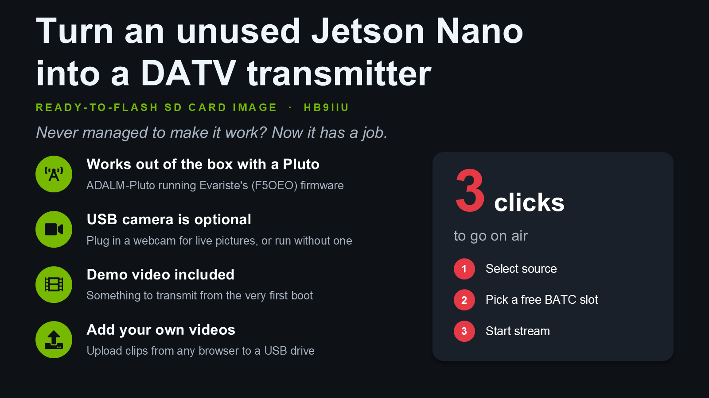
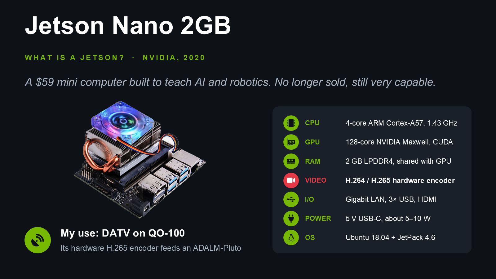
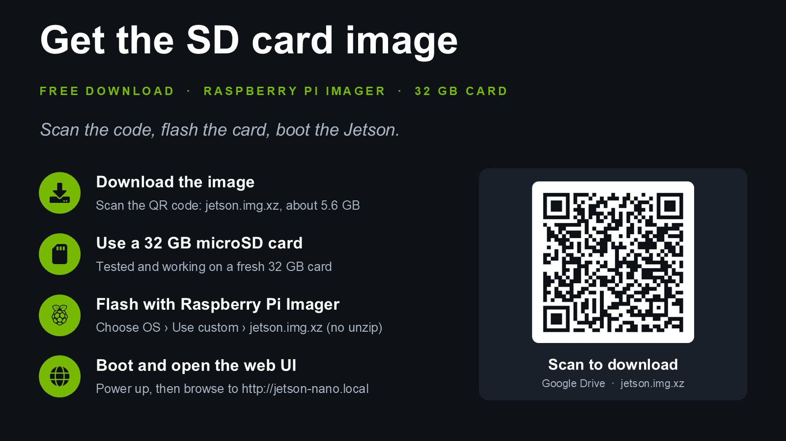
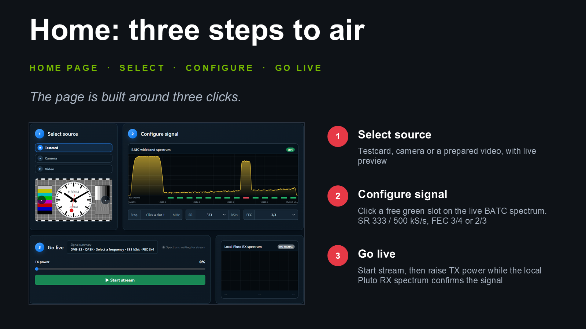
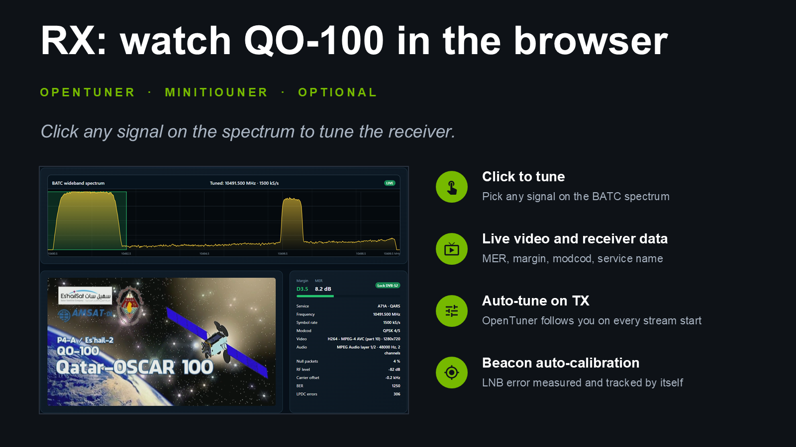

# HB9IIU Jetson DATV Transmitter

**Got a Jetson Nano 2GB in a drawer? Turn it into a QO-100 DATV transmitter.**



This project turns an NVIDIA Jetson Nano 2GB and an ADALM-Pluto into a
complete DVB-S2 transmitter for the QO-100 wideband transponder. Everything is
controlled from a web page: choose what to send, pick a free slot on the BATC
spectrum, and press Start.

The Jetson's hardware H.265 encoder does the hard work. The Pluto, running
Evariste's (F5OEO) PlutoDVB2 firmware, does the DVB-S2 modulation.

```
[camera / testcard / video] -> [Jetson: H.265 + AAC, MPEG-TS] -> [Pluto: DVB-S2] -> [your upconverter / PA] -> QO-100
```

## What you need



- **Jetson Nano 2GB Developer Kit** with a good 5 V / 3 A USB-C supply
- **32 GB microSD card**
- **ADALM-Pluto** with the latest
  [PlutoDVB2 firmware by F5OEO](https://github.com/F5OEO/plutosdr-fw/releases),
  connected to the Jetson by USB
- **Network connection** for the Jetson (the BATC spectrum comes from the internet)
- **Your QO-100 uplink**: amplifier, dish, feed
- **A receiver** to watch your own signal, e.g. a MiniTiouner with the
  [modified OpenTuner](https://github.com/HB9IIU/HB9IIU-Jetson-DATV-OpenTuner)
  (see [Receiving with OpenTuner](#receiving-with-opentuner-optional))
- Optional: a **USB webcam** (tested with a Logitech C920), a **USB stick** for
  your own videos, and a **relay module** for the PA (see below)
- An **amateur radio licence** that allows you to transmit on QO-100

## Quick start: the ready-to-flash SD card image



1. **Download** the image `jetson.img.xz` (about 5 GB):
   [Google Drive](https://drive.google.com/file/d/1KOO9mWcRhIP5yVT3PENrq5p7Ek5pGANZ/view?usp=sharing)
2. **Flash** it with [Raspberry Pi Imager](https://www.raspberrypi.com/software/):
   *Choose OS → Use custom → jetson.img.xz* (no need to unzip), choose the card, *Write*.
   Tested and working on a 32 GB card. (balenaEtcher failed during validation
   in our tests, so we don't recommend it.)
   On Linux: `xzcat jetson.img.xz | sudo dd of=/dev/sdX bs=4M status=progress conv=fsync`,
   then `sudo sgdisk -e /dev/sdX`.
3. **Boot** the Jetson with the Pluto plugged in.
4. **Open** `http://jetson-nano.local` in a browser on the same network.
5. Go to **Setup** and enter **your callsign**.
6. **Go on air in 3 clicks:** select a source, pick a free BATC slot, start the stream.

Linux login for SSH: user `daniel`, password `a`. Please change it with `passwd`.

The image uses 20 GB of the card. On a bigger card the rest stays unused
(you can grow the partition later with GParted).

## Features



- **Three sources**
  - **Testcard**: still test pictures with a short melody, plus a live
    station clock (SBB style) with test tones
  - **Camera**: live picture and sound from a USB webcam
  - **Video**: your own video files, prepared once and then sent from a USB stick
- **BATC wideband spectrum** in the page: free channels show green, busy ones
  red. Click a green one to set the frequency.
- **Local Pluto RX spectrum**, so you can see your own carrier right away
- **On-screen overlays**: callsign, clock, frequency, top/bottom banners and
  a scrolling text line
- **TX power control**, which always goes back to 0% when you stop
- **Video Library** (`http://jetson-nano.local:8088`): upload a video from any
  browser. The Jetson converts it for DATV (this takes about as long as the
  video itself).
- **Optional PA relay** that keeps your amplifier off while the Pluto starts up
- **RX page and On-air monitor** (optional, with OpenTuner): watch QO-100 in
  the browser, click a signal to tune, and see your own signal come back
  through the satellite while you transmit
- **Frequency correction**: LNB error calibrated on the beacon, and the
  Pluto's TX error measured on your own signal
- Runs as a service: switch on the Jetson and the web page is there

## Transmission settings

All modes send 1280×720 at 25 fps, H.265 video and 32 kbps AAC audio,
DVB-S2 QPSK, long frames, pilots on.

| Symbol rate | FEC | Video bitrate (testcard / camera / video) |
|---|---|---|
| 333 kS/s | 2/3 | 292 / 298 / 292 kbps |
| 333 kS/s | 3/4 | 342 / 350 / 342 kbps |
| 500 kS/s | 2/3 | 498 / 498 / 498 kbps |
| 500 kS/s | 3/4 | 575 / 575 / 575 kbps |

These bitrates were measured on real hardware, not just calculated. Each one
fits safely inside the DVB-S2 channel, so the stream never runs out of room.
The encoder uses a 4 s GOP and 4 reference frames, similar to what OBS with
Easy DATV uses.

**Not sure what to choose?** Keep SR 333 and FEC 3/4 (the defaults). SR 500
gives a better picture but needs a stronger signal. FEC 2/3 is more robust
when reception is difficult.

## The PA relay (optional)

The Pluto can send short **full-power spikes** while it starts up or is
reconfigured, whatever the power setting. These can damage a driver or PA.
The relay output keeps the PA off until you press *Switch PTT relay ON*
while a stream is running - wait until the local Pluto RX spectrum looks
stable first (its status is advice only; you decide). It switches off by
itself when you stop or when the stream ends.

- Output: **physical pin 18** of the Jetson's 40-pin header (ground on e.g. pin 20)
- Engaged = 3.3 V, off = 0 V

> ⚠️ Pin 18 is the **physical pin number**, not "GPIO18" in Raspberry Pi
> naming. The pin only gives a few milliamps. Use a relay module with a
> 3.3 V logic input, never a bare relay coil.

## Receiving with OpenTuner (optional)



With a **MiniTiouner** and the
[modified OpenTuner](https://github.com/HB9IIU/HB9IIU-Jetson-DATV-OpenTuner)
on a Windows PC, the Jetson can tune the receiver and show what it receives:

- **RX page**: click any signal on the BATC spectrum to tune OpenTuner. The
  received video plays in the browser, with margin, MER, MODCOD and service name.
- **Auto-tune on TX**: every time you start a stream, OpenTuner is tuned to
  your own signal.
- **On-air monitor**: while you transmit, card 1 on the Home page shows your
  own picture received back through QO-100, with margin and MER.
- **Beacon auto-calibration**: while OpenTuner is locked on the beacon, the
  LNB frequency error is measured and followed by itself.
- **TX frequency correction**: the Pluto's own frequency error is measured on
  your signal and applied from the next start, so you land in the slot.

Setting it up:

1. Install the modified OpenTuner on a Windows PC on the same network as the Jetson.
2. Under **Extra Features**, enable **Quick Tune Control**.
3. Enable **Jetson Stream** and enter the Jetson's IP address and port **5001**.
4. On the Jetson's **Setup** page, in the **OpenTuner** section, enable
   **Auto-tune on stream start**. The defaults are UDP port **6789** and LNB
   offset **9750000 kHz**.
5. Press **Save**, then **Test: tune to beacon**. OpenTuner should lock on the beacon.

## Credits

- **Evariste F5OEO** for the PlutoDVB2 firmware, which makes all of this possible
- **[DATV-Red](https://github.com/Psynosaur/DATV-Red)**, whose source showed
  how to control the PlutoDVB2 firmware over MQTT
- **Tom ZR6TG** for OpenTuner, the base of the modified receiver software
- **BATC** for the QO-100 wideband spectrum monitor
- **AMSAT-DL** and everyone who keeps QO-100 running
- **Claude (Anthropic)**, my coding assistant, which wrote a lot of the code
  and never once complained about "just one more small change", even at
  midnight. It still has no licence and has never been on air.

## License

MIT, see [LICENSE](LICENSE).

73 de **HB9IIU**
